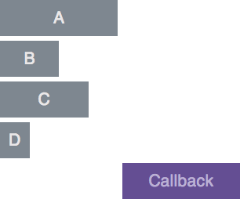
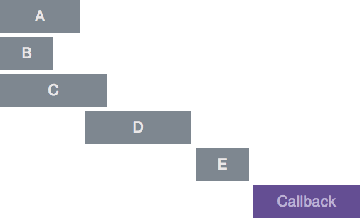

kuji
====

### Asynchronous Control Flow library for Node.

Browsers are not supported yet, it will be added later.

## Control Flow

### kuji.inline
`kuji.inline` runs tasks **in-line**:


```js
var kuji = require('kuji');

kuji.inline([
  function (next) {
    next();
  },
  function (next) {
    next();
  },
  function (next) {
    next();
  },
  function (next) {
    next();
  }
]);
```

### kuji.parallel
`kuji.parallel` runs tasks **in parallel** and goes to the final callback when all tasks finished:



```js
var kuji = require('kuji');

kuji.parallel([
  function (next) {
    next();
  },
  function (next) {
    next();
  },
  function (next) {
    next();
  },
  function (next) {
    next();
  }
], function () {
  // This will be executed when all will be finished
});
```


### kuji.graph
`kuji.graph` permits you to easily run __tasks graphs__:



You can see that __D__ will be executed once its dependencies (__A__ and __B__) are finished, permitting you to be sure that the data you need from these tasks will be available.

```js
var kuji = require('kuji'),
    dependsOn = kuji._dependsOn;

kuji.graph({
  a: function (next) {
    next()
  },
  b: function (next) {
    next();
  },
  c: function (next) {  
    next();
  },
  d: dependsOn(['a', 'b'], function (next) {
    next();
  }),
  e: dependsOn(['d', 'c'], function (next) {
    next();
  })
}, function () {
  // This will be executed at the end of your graph
});
```

For the moment you need to use a closure to share data between tasks, but this will be patched in the next few days.

## Coming next
- Error handling through `next()`
- Passing values through `next()`
- Benchmark
- Perfomance optimization

## Testing
To run the tests :
```
mocha
```

## License
MIT
